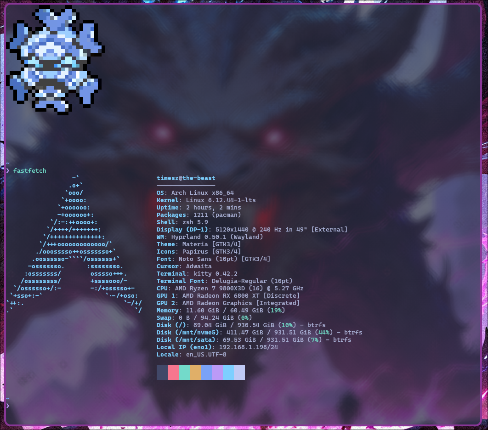
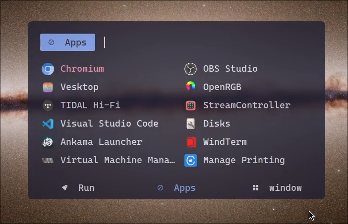
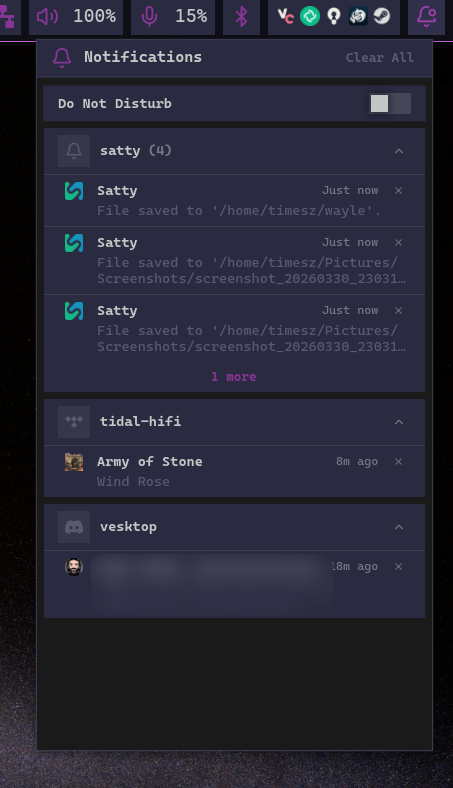
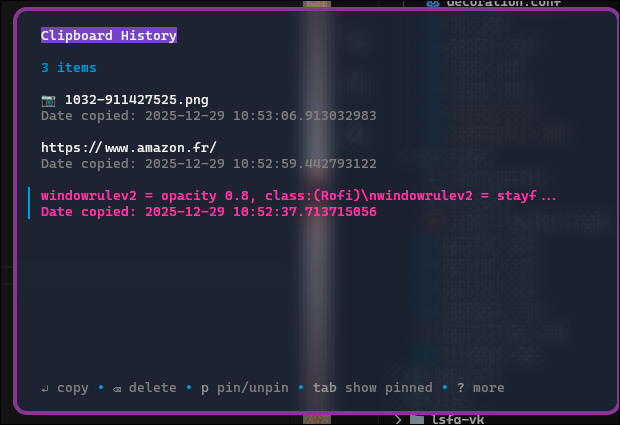
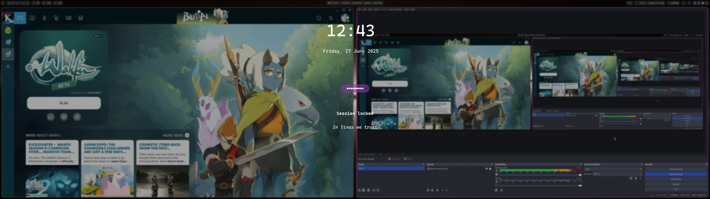

# Dotfiles

Personal configuration for my Arch Linux environment.

## Install

### Get the archinstall json pre-configuration
```bash
curl -o /tmp/user_configuration.json https://raw.githubusercontent.com/Times-Z/dotfiles/refs/heads/main/user_configuration.json
```

### Use arch install pre-configuration json
Just user and disk to configure

```bash
archinstall --config /tmp/user_configuration.json
```

### Install dotfiles
```bash
curl -s https://raw.githubusercontent.com/Times-Z/dotfiles/refs/heads/main/install.sh | bash -s --
```

## System Overview

- **OS:** Arch Linux
- **WM:** Hyprland (Wayland)
- **Shell:** zsh
- **Terminal:** kitty

## Screenshots

### Terminal


### Rofi


### Hyprpanel (with notifications)




### Clipboard


### Lockscreen

