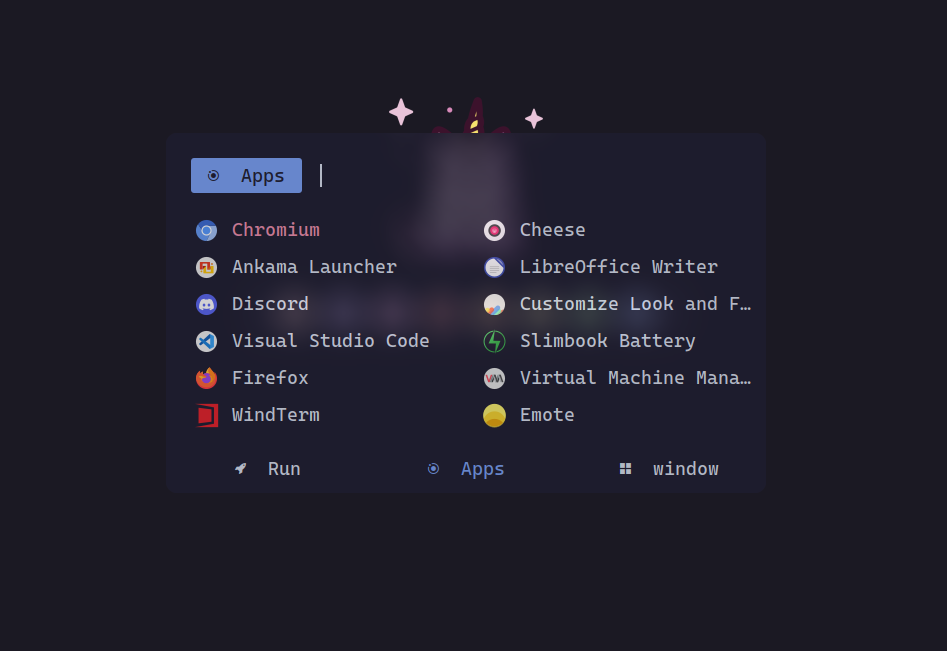
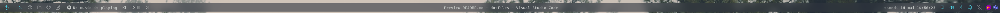
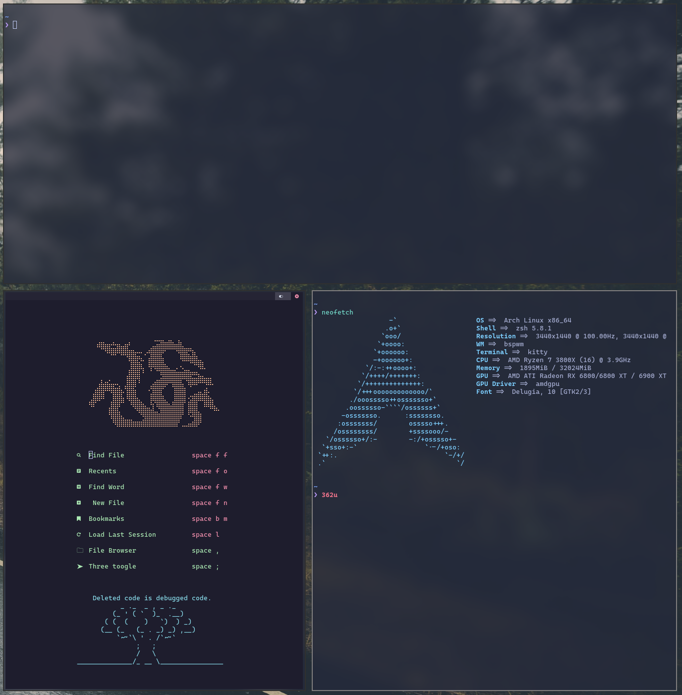
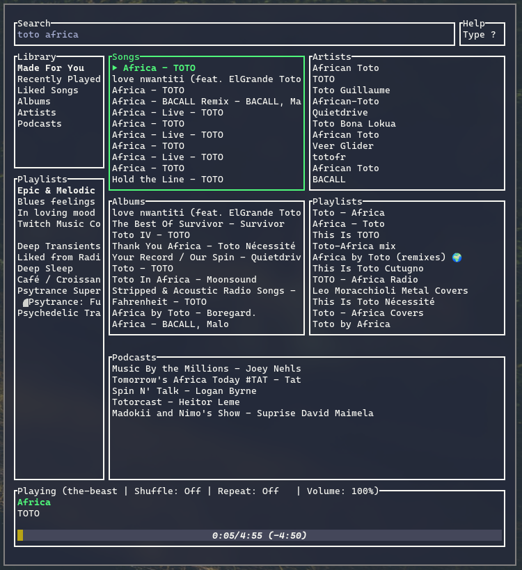
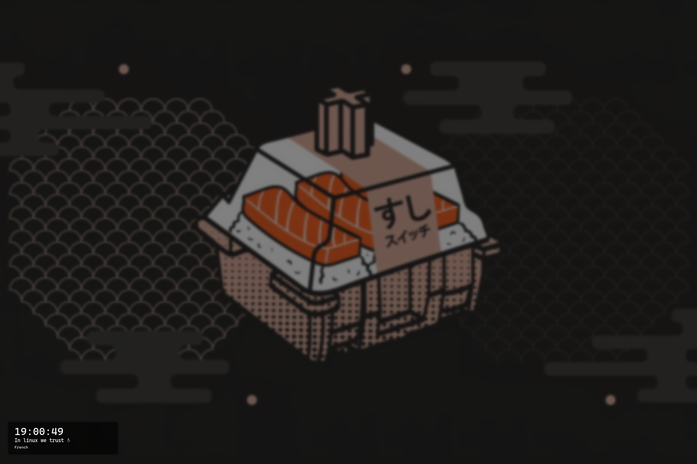

# Dotfiles

My personal backup dotfiles

⚠️ Wallpaper not included ⚠️

## Config contents
- Bspwm (+ .xinitrc/.zprofile)
- Dunst
- Kitty
- Neofetch
- Neovim (to used with [nvchad](https://nvchad.github.io/))
- Picom
- Polybar
- Ranger rifle (mime)
- Rofi
- Spotify-tui
- Sxhkd
- BetterLockScreen

## Screenshots

Rofi :

Polybar :

Picom blur/neovim/neofetch :

Spotify-tui :

BetterLockScreen :

