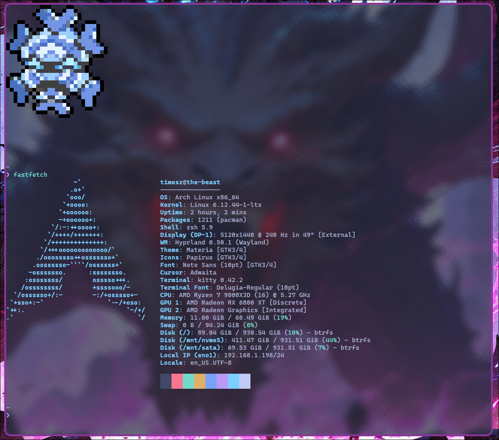
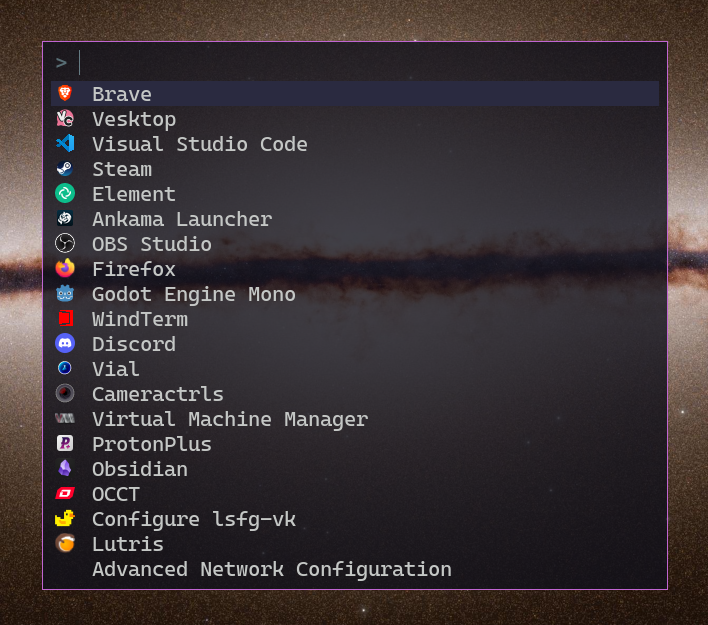
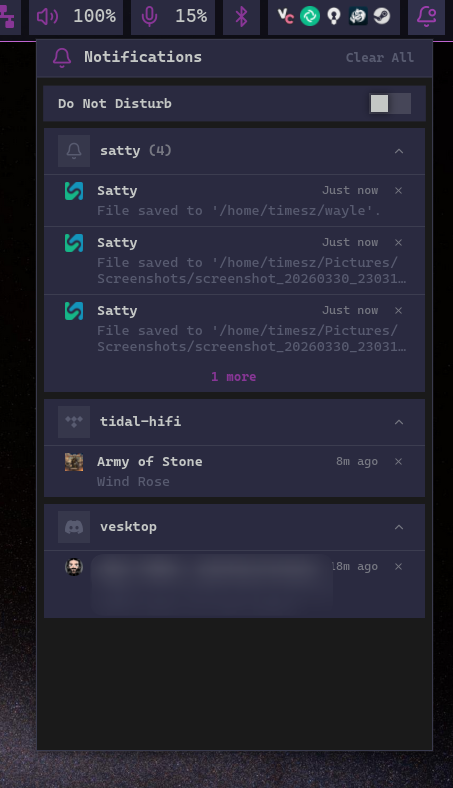
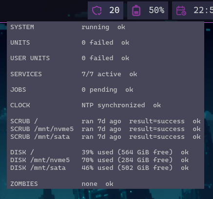
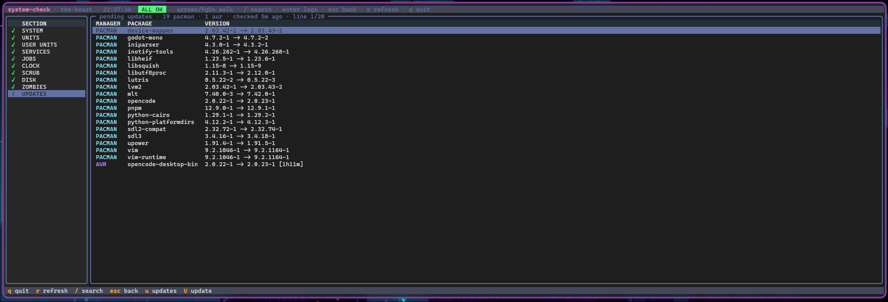
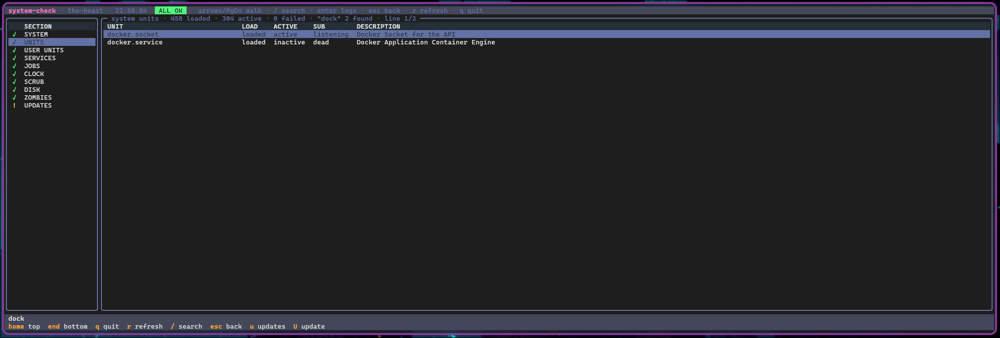
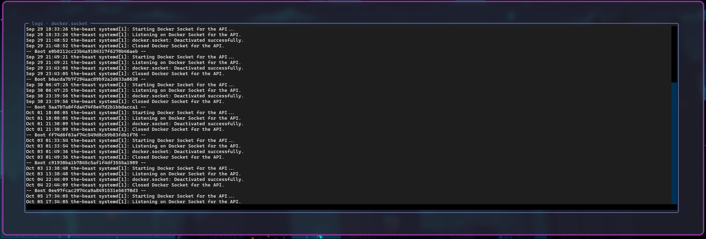
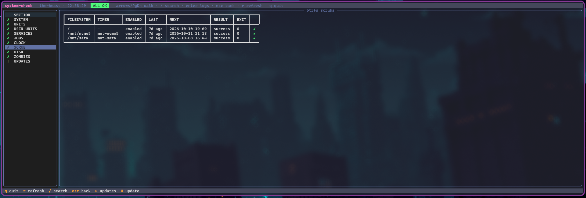
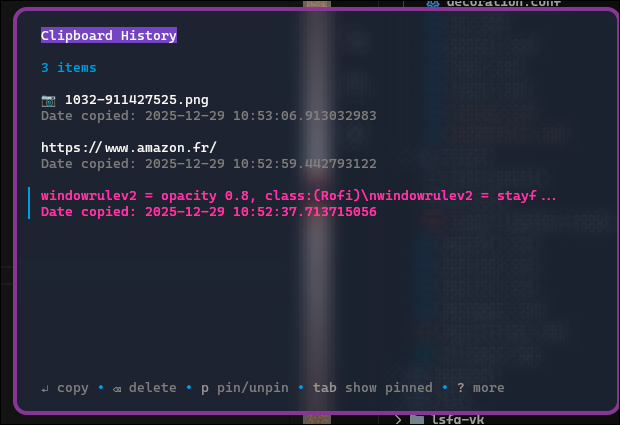
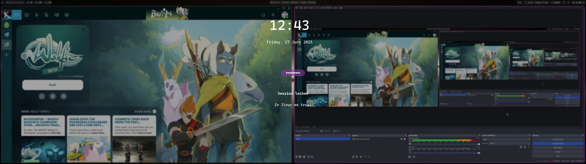

# Dotfiles

Personal configuration for my Arch Linux environment.

## Install

### Get the archinstall json pre-configuration
```bash
curl -o /tmp/user_configuration.json https://raw.githubusercontent.com/Times-Z/dotfiles/refs/heads/main/user_configuration.json
```

### Use arch install pre-configuration json
Just user and disk to configure

```bash
archinstall --config /tmp/user_configuration.json
```

### Install dotfiles
```bash
curl -fsSL https://raw.githubusercontent.com/Times-Z/dotfiles/main/install.sh | bash -s --
```

## System Overview

- **OS:** Arch Linux
- **WM:** Hyprland (Wayland)
- **Shell:** zsh
- **Terminal:** kitty

## Screenshots

### Terminal


### Fuzzel


### Wayle (with notifications)




#### Wayle system check custom module






### Clipboard


### Lockscreen


## System configs (etc/)

Personalized system files are mirrored under [`etc/`](etc/) and restored with `sudo ./install_system.sh` (fresh-install oriented — overwrites `/etc`)