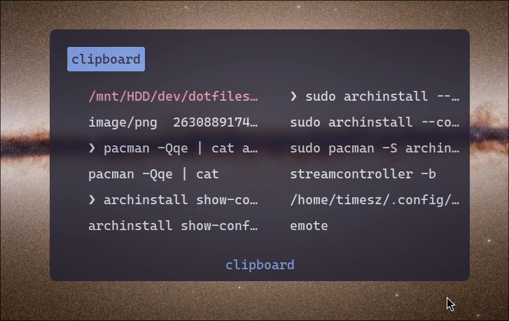

# Dotfiles

Personal configuration for my Arch Linux environment.

## System Overview

- **OS:** Arch Linux
- **WM:** Hyprland (Wayland)
- **Shell:** zsh
- **Terminal:** kitty

## Included Configurations

- Hyprland + Waybar
- Dunst
- Kitty
- Neovim
- Ranger (rifle/mime)
- Rofi

## Screenshots

### Terminal

### Rofi

### Waybar

### Dunst (Notifications)

### Clipboard

### Lockscreen

