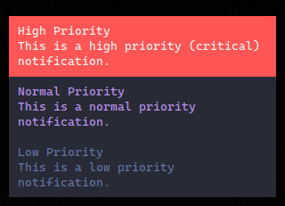

# Dotfiles

Personal configuration for my Arch Linux environment.

## Install
```
curl -s https://raw.githubusercontent.com/Times-Z/dotfiles/refs/heads/main/install.sh | bash -s --
```

## System Overview

- **OS:** Arch Linux
- **WM:** Hyprland (Wayland)
- **Shell:** zsh
- **Terminal:** kitty

## Included Configurations

- Hyprland (hypridle, hyprlock, hyprpaper, modules)
- Waybar
- Dunst
- Kitty
- Neovim
- Ranger (rifle)
- Rofi
- Pipewire
- Gpicview
- Custom font (TimeszFont)
- Greenclip
- Wlogout
- Wireplumber
- Zsh (.zshrc)

## Screenshots

### Terminal


### Rofi


### Hyprpanel (with notifications)



### Clipboard


### Lockscreen

